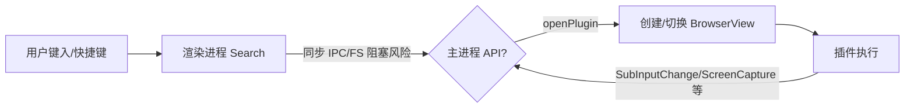

# Rubick 项目潜在缺陷与风险报告

本报告基于对当前代码库的静态检查整理。每条问题均给出证据位置与修复建议。点击方括号中的链接可直达对应文件行。

## 总览
- 类型/设计问题：配置 API 同步/异步不一致、语义化版本比较错误
- 安全配置问题：Electron 窗口 webPreferences 过于宽松
- 组件 Props 定义不规范：Vue defineProps 使用错误
- 交互/逻辑问题：插件加载状态不复位、快捷键无保护访问、UI 条件渲染不合理
- 性能/体验：渲染进程中大量同步操作（IPC/FS）
- 脚本/平台：跨平台脚本符号不兼容

---

## 1. 配置 API 类型签名与使用不一致
- 证据
  - [localConfig.getConfig()](src/renderer/confOp.ts:4) 声明返回 Promise，但函数体同步返回普通对象，未返回 Promise。
  - 渲染进程同步调用配置： [createApp 配置主题使用](src/renderer/main.ts:19) 将其当作同步值使用。
- 风险
  - TypeScript 类型与实现不一致，易引发误用；难以统一后续调用方式。
- 修复建议
  - 若保持同步：将签名改为非 Promise 类型，并标注返回结构类型。
  - 若改为异步：改为 async/Promise，并在所有调用处 await，例如 [ConfigProvider.config 调用处](src/renderer/main.ts:21)。

## 2. 插件加载状态未复位（系统插件短路）
- 证据
  - [createPluginManager.loadPlugin()](src/renderer/plugins-manager/index.ts:65) 在设定 `pluginLoading = true` 后，若插件名为 `rubick-system-feature`，直接 return，导致 `pluginLoading` 永远为 true。
- 影响
  - 界面可能持续处于“更新检测中/加载中”状态，影响交互。
- 修复建议
  - 在 return 前补充 `state.pluginLoading = false`。

## 3. 语义化版本比较错误（字符串比较）
- 证据
  - [AdapterHandler.upgrade()](src/core/plugin-handler/index.ts:74) 使用 `latestVersion > installedVersion` 直接比较字符串。
- 风险
  - 例如 `10.0.0` 与 `2.0.0` 字符串比较会得到错误结果。
- 修复建议
  - 使用 `semver` 库：`semver.gt(latest, installed)`；或在安装/更新逻辑中统一使用 semver 判断。

## 4. Electron 窗口安全策略过于宽松
- 证据
  - [BrowserWindow webPreferences](src/main/browsers/main.ts:35) 启用了 `nodeIntegration: true`、`contextIsolation: false`、`webSecurity: false`、`webviewTag: true`。
- 风险
  - 增大 XSS 与原生能力被滥用风险。
- 修复建议（渐进兼容）
  - 优先开启 `contextIsolation: true`。
  - 关闭 `nodeIntegration`，通过 preload 注入白名单 API。
  - 仅在必要页面或开发环境下放宽 `webSecurity`。
  - 审核并限制 `webviewTag` 使用场景。

## 5. Vue 组件 Props 定义不规范
- 证据
  - [result.vue defineProps](src/renderer/components/result.vue:141) 中 `pluginHistory`、`clipboardFile` 直接赋值 `(() => [])()`，缺少 `type` 与 `default` 工厂写法。
  - [search.vue defineProps](src/renderer/components/search.vue:81) 同样问题。
- 影响
  - 违反 Vue3 运行时校验与最佳实践，潜在导致默认值共享、类型推断失效。
- 修复建议
  - 使用：`{ type: Array, default: () => [] }`；对象同理使用 `default: () => ({})`。

## 6. UI 渲染条件导致推荐区块缺失
- 证据
  - [result.vue 模板条件](src/renderer/components/result.vue:34) 使用 `v-else-if="sortedOptions.bestMatches && sortedOptions.bestMatches.length"` 才进入网格展示；若无最佳匹配但有推荐，则退回到列表后备，推荐网格永不出现。
- 修复建议
  - 条件应为“最佳匹配或推荐任一存在”即可进入新版网格展示：`bestMatches.length || recommendations.length`。

## 7. 全局快捷键回调缺少空数组保护
- 证据
  - [optionsManager: global-short-key](src/renderer/plugins-manager/options.ts:81) 直接 `options[0].click()`，未判断 `options` 是否为空。
- 风险
  - 当无匹配项时抛出异常。
- 修复建议
  - 访问前判空：`if (options.length) options[0].click()`。

## 8. 渲染进程中同步 IPC 调用阻塞 UI
- 证据
  - 同步转发搜索子输入： [sendSync SubInputChange](src/renderer/components/search.vue:163)
  - 同步获取图标： [sendSync getFileIcon](src/renderer/components/search.vue:253)
- 风险
  - 同步 IPC 会阻塞渲染线程，影响输入与动画流畅度。
- 修复建议
  - 改为 `ipcRenderer.invoke/handle` 异步模式；或预取缓存图标数据。

## 9. 渲染进程执行同步文件系统遍历
- 证据
  - [本地文件搜索使用 fs.readdirSync](src/renderer/plugins-manager/options.ts:223)
- 风险
  - 同步 IO 阻塞 UI；目录较大时明显卡顿。
- 修复建议
  - 迁移到主进程（`ipcMain.handle`）或使用 Worker/异步 API，并限制搜索深度/数量与节流。

## 10. 脚本跨平台不兼容
- 证据
  - [package.json 脚本 feature:dev](package.json:10) 使用 `cd feature & npm run serve`，`&` 为 Windows CMD 运算符；在 macOS/Linux 上应使用 `&&`。
- 修复建议
  - 改为 `cd feature && npm run serve`，或使用 `npm --workspace`/`npm run --prefix`，或使用 `cross-env-shell` 统一。

## 11. 应用搜索导出在极端平台上可能为 undefined
- 证据
  - [app-search/index.ts 默认导出](src/core/app-search/index.ts:13) 直接 `export default appSearch.default`；若三种平台判断均未命中（理论极小概率），则 `appSearch` 为 `undefined`。
- 修复建议
  - 提供兜底分支/断言：若 `!appSearch` 则抛出明确错误或返回空实现。

## 12. remote 使用方式混杂
- 证据
  - 同文件混用 ESM 与 `window.require`： [import getGlobal](src/renderer/App.vue:41) 与 [window.require('@electron/remote')](src/renderer/App.vue:47)。
- 风险
  - 可读性与可维护性差；在安全策略收紧后更难统一迁移。
- 修复建议
  - 统一通过 preload 暴露 API，或统一 ESM/remote 的封装。

## 13. 命令执行缺少防御
- 证据
  - 打开系统应用时执行命令： [exec(plugin.action)](src/renderer/plugins-manager/index.ts:105)
  - 从历史中触发： [exec(currentChoose.action)](src/renderer/App.vue:140)
- 风险
  - 传入 action 未过滤可能带来意外行为（来源仍需确保可信）。
- 修复建议
  - 限定来源为受信白名单（如系统应用列表），或使用 shell.openPath 等更安全方式。

## 14. 其他建议项
- `package.json` 将 `npm` 作为依赖但实际通过 `spawn('npm', args)` 调用系统 npm（[AdapterHandler.execCommand()](src/core/plugin-handler/index.ts:172)）。若用户环境未安装 Node/npm，将导致插件安装失败。建议：
  - 明确依赖前置条件；或捆绑 Node 与 npm-cli.js 通过 `node path/to/npm-cli.js` 调用；或改用 `pnpm`/`yarn` 并内置。
- 结果排序函数直接原地交换元素（[result.vue sort](src/renderer/components/result.vue:176)），可能引入副作用。建议拷贝后排序。

---

## 优先修复清单（建议顺序）
1) 修复 `pluginLoading` 不复位问题，避免基础交互异常（[loadPlugin](src/renderer/plugins-manager/index.ts:70)）。
2) 修复语义化版本比较，避免升级失效（[upgrade](src/core/plugin-handler/index.ts:74)）。
3) 收紧 Electron 窗口安全配置（[BrowserWindow.webPreferences](src/main/browsers/main.ts:35)）。
4) 统一并修正 `defineProps` 的默认值写法（[result.vue](src/renderer/components/result.vue:141)，[search.vue](src/renderer/components/search.vue:81)）。
5) 去除同步 IPC 与同步 FS，避免 UI 阻塞（[search.vue sendSync](src/renderer/components/search.vue:163)，[options.ts fs.readdirSync](src/renderer/plugins-manager/options.ts:223)）。
6) 脚本跨平台修正（[package.json](package.json:10)）。

---

## 参考流程（Mermaid）

报告到此结束。
