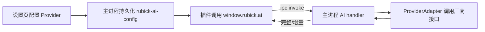

# Rubick AI 快速开始（插件与基座）

本指南帮助你在最短时间内完成：配置大模型 Provider、在插件中调用 AI 能力（流式/非流式）、以及常见问题排查。请结合以下文档一起使用：
- 基座集成与架构：[AI 能力集成](./ai-integration.md)
- 设置页接入与管理：[AI 接入管理（设置）](../guide/ai-settings.md)
- 插件侧接口参考：[插件 AI API 参考](./ai-plugin-api.md)
- 主进程路由挂载点：[API.init()](src/main/common/api.ts:35)、[ipcMain.on](src/main/common/api.ts:37)

## 1. 前置条件
- 已使用设置页配置至少一个可用 Provider（OpenAI/Azure/Anthropic/Gemini/通义千问/文心/Ollama/兼容端点）。配置步骤见：[AI 接入管理](../guide/ai-settings.md)
- 默认 Provider 已设置，或你将在调用时显式传入 provider（优先级：入参.provider > 配置 defaultProvider）。

## 2. 基本流程



- 配置存取与版本初始化流程参考：[initLocalConfig.getConfig()](src/main/common/initLocalConfig.ts:27)、[initLocalConfig.setConfig()](src/main/common/initLocalConfig.ts:33)
- 事件增量推送可沿用回传模式：[sendPluginSomeKeyDownEvent()](src/main/common/api.ts:288)

## 3. 在插件里调用文本生成

非流式（完整结果）：
```ts
const res = await window.rubick.ai.invoke({
  // 可省略，使用默认 Provider：provider: 'openai',
  model: 'gpt-4o-mini',
  messages: [
    { role: 'system', content: '你是 Rubick 插件助手' },
    { role: 'user', content: '总结以下段落为3条要点：...' },
  ],
  temperature: 0.7,
  max_tokens: 800,
});
console.log(res.text);
```

流式（推荐用于对话/打字机效果）：
```ts
let acc = '';
const stream = await window.rubick.ai.stream({
  model: 'gpt-4o-mini',
  messages,
});
for await (const chunk of stream) {
  acc += chunk.delta; // 增量 token
  render(acc);        // 自行实现渲染逻辑
}
```

- 主进程 handler 建议命名为 `aiInvoke`/`aiStream`，统一在 [API.init()](src/main/common/api.ts:35) 路由挂接。

## 4. 向量嵌入（Embeddings）
```ts
const out = await window.rubick.ai.embed({
  model: 'text-embedding-3-small',
  input: ['文本1', '文本2'],
});
// out.vectors: number[][] 与输入一一对应
```

## 5. 图像生成
```ts
const img = await window.rubick.ai.image.generate({
  prompt: 'A watercolor cat',
  size: '512x512',
  format: 'filePath', // 或 'dataURL'
});
// 优先 filePath，避免大 DataURL 堵塞 IPC
```

## 6. 语音转文字（可选）
```ts
const text = await window.rubick.ai.speech.transcribe({
  model: 'whisper-1',
  filePath: '/path/to/audio.m4a',
});
```

## 7. 常见错误与排查
- ERR_PROVIDER_NOT_FOUND：未配置 Provider 或名称不匹配
  - 操作：前往设置页新增/修正 Provider，或在入参里显式传入正确的 provider
- ERR_UNAUTHORIZED：密钥/鉴权失败
  - 操作：检查 API Key/Secret/部署 ID/Region 等
- ERR_RATE_LIMIT：频控，需退避重试
- ERR_NETWORK/ERR_TIMEOUT：网络异常或超时
  - 操作：检查代理/超时配置（rubick-ai-config.timeoutMs），或在入参覆盖

插件侧建议统一 try/catch：
```ts
try {
  const res = await window.rubick.ai.invoke({ model: 'gpt-4o-mini', messages });
} catch (e) {
  // e.code: 'ERR_*'，e.message 可用于 UI 提示
}
```

## 8. 性能与体验建议
- 流式输出采用节流（主进程）+ 合并渲染（渲染层）
- 大响应（图像/音频）优先通过文件路径传递
- 避免渲染层同步 IPC（例如 sendSync）；AI 接口一律异步
- 在窗口安全策略收紧后，通过 preload 暴露白名单 API；配置位置参考：[BrowserWindow(webPreferences)](src/main/browsers/main.ts:35)

## 9. 完整示例（聊天面板）
```ts
import { ref } from 'vue';

const messages = ref([
  { role: 'system', content: '你是 Rubick 插件助手' },
]);

async function send(text: string) {
  messages.value.push({ role: 'user', content: text });
  let acc = '';
  try {
    const stream = await window.rubick.ai.stream({ model: 'gpt-4o-mini', messages: messages.value });
    for await (const chunk of stream) {
      acc += chunk.delta;
      // 渲染 acc
    }
  } catch (e) {
    // 统一错误处理：ERR_PROVIDER_NOT_FOUND/ERR_UNAUTHORIZED/...
  }
  messages.value.push({ role: 'assistant', content: acc });
}
```

## 10. 清单检查（文档完整性）
- [x] 架构与主进程挂载点：[AI 能力集成](./ai-integration.md)
- [x] 设置页接入流程与字段校验：[AI 接入管理](../guide/ai-settings.md)
- [x] 插件调用 API 规范与类型：[插件 AI API 参考](./ai-plugin-api.md)
- [x] 快速开始与常见问题：本文件

若开始落地实现主进程 handler，请在 [API.init()](src/main/common/api.ts:35) 处新增 `aiInvoke`/`aiStream`/`aiEmbeddings`/`aiImageGenerate`/`aiTranscribe` 分发，并与设置页 `ai:testConnection` 对齐。