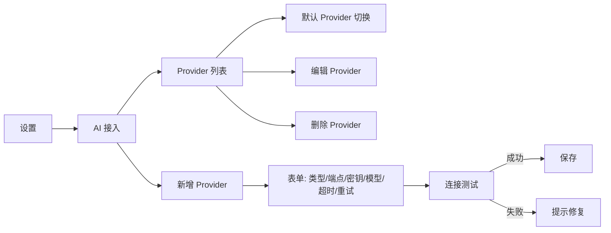

# 设置中增加 AI 接入管理（设计与落地指南）

本文档定义在 Rubick 的“设置/偏好”中新增“AI 接入管理”，用于统一配置与管理主流大模型 Provider，并为插件提供一致的调用能力。该设计不依赖具体厂商 SDK，基座通过主进程网关做适配与转发。

## 目标
- 在设置界面新增“AI 接入”入口，支持添加/编辑/删除多个 Provider（OpenAI、Azure OpenAI、Anthropic、Gemini、通义千问、文心、Ollama、任意 OpenAI 兼容端点）。
- 配置保存到本地数据库，主进程统一读取与校验，插件通过统一 API 调用。
- 支持连接测试、默认 Provider 切换、网络重试与超时策略。
- 与现有主进程路由与 DB 机制保持一致：入口参考 [API.init()](src/main/common/api.ts:35)；事件推送参考 [sendPluginSomeKeyDownEvent()](src/main/common/api.ts:288)。

## 界面信息架构



- Provider 列表显示：类型、模型、端点、状态（可用/不可用）、是否默认。
- 表单字段：
  - 类型（openai、azureOpenAI、anthropic、gemini、dashscope、ernie、ollama、openaiCompatible）
  - API Key / Secret（按类型动态显示）
  - 端点或 baseUrl（例如 OpenAI https://api.openai.com/v1，Azure endpoint + apiVersion + deploymentId）
  - 模型（如 gpt-4o-mini、claude-3-5-sonnet、gemini-1.5-pro、qwen-plus、ernie-4.0-8k、ollama 本地模型名）
  - 超时 timeoutMs（默认 60000）
  - 重试策略（retries、factor）
  - 默认 Provider（布尔）

## 配置存储与读取
- 本地配置键：`rubick-ai-config`
- 与现有本地配置读写保持一致：主进程参考 [initLocalConfig.init()](src/main/common/initLocalConfig.ts:8)、[initLocalConfig.getConfig()](src/main/common/initLocalConfig.ts:27)、[initLocalConfig.setConfig()](src/main/common/initLocalConfig.ts:33)。
- 渲染层可通过轻量封装读取 UI 所需的只读快照（避免直接暴露密钥）：参考 [localConfig.getConfig()](src/renderer/confOp.ts:4)、[localConfig.setConfig()](src/renderer/confOp.ts:9)。

建议配置结构（仅示例，不含真实密钥）：

```json
{
  "providers": [
    { "type": "openai", "baseUrl": "https://api.openai.com/v1", "apiKey": "sk-...", "model": "gpt-4o-mini" },
    { "type": "azureOpenAI", "endpoint": "https://xxx.openai.azure.com", "apiKey": "...", "deploymentId": "gpt-4o", "apiVersion": "2024-08-01-preview" },
    { "type": "anthropic", "apiKey": "...", "model": "claude-3-5-sonnet" },
    { "type": "gemini", "apiKey": "...", "model": "gemini-1.5-pro" },
    { "type": "dashscope", "apiKey": "...", "model": "qwen-plus" },
    { "type": "ernie", "apiKey": "...", "secretKey": "...", "model": "ernie-4.0-8k" },
    { "type": "ollama", "url": "http://localhost:11434", "model": "llama3" },
    { "type": "openaiCompatible", "baseUrl": "https://your-compat-endpoint/v1", "apiKey": "...", "model": "gpt-4o-mini" }
  ],
  "defaultProvider": "openai",
  "timeoutMs": 60000,
  "retry": { "retries": 2, "factor": 2 }
}
```

## 主进程接口（设置与 AI 网关协同）
- 路由注册位置：参考 [API.init()](src/main/common/api.ts:35)，在统一 `ipcMain` 处理器中新增设置相关 handler：
  - ai:getConfig（返回 rubick-ai-config 快照给设置界面，仅包含非敏感字段或以占位显示）
  - ai:setConfig（写入 rubick-ai-config，主进程校验后持久化）
  - ai:testConnection（根据类型与端点/密钥发起一次最小化 API 调用，返回通过/失败与错误信息）
- AI 实际调用 handler 与文档参考：见 [docs/development/ai-integration.md](docs/development/ai-integration.md)

## 安全策略
- 密钥仅存储主进程/数据库，不直接回传到渲染层；渲染层显示为 `•••••`。
- 建议逐步收紧窗口安全策略：参考 [BrowserWindow webPreferences](src/main/browsers/main.ts:35)，开启 contextIsolation、关闭 nodeIntegration（通过 preload 注入白名单 API）。
- 设置界面调用主进程时使用异步 IPC，避免阻塞：渲染层避免 sendSync。示例位置参照 [ConfigProvider.config()](src/renderer/main.ts:21) 的调用模式，将其作为异步更新。

## 交互与校验规则
- 端点/baseUrl 必须是合法 URL；Azure 需包含 `apiVersion` 与 `deploymentId`；Ollama 需检测本地端口可达。
- 模型名称必须非空；Provider 类型与字段动态校验。
- `连接测试` 正常返回后才允许保存；失败提示错误码与响应片段。
- 默认 Provider 切换时，提示影响范围（插件调用统一走默认 Provider，插件也可在调用参数中覆盖 provider）。

## 与插件的协作关系
- 插件通过 `window.rubick.ai` 访问 AI 能力（统一异步接口），主进程完成 Provider 选择与鉴权，插件不直接接触密钥。
- 流式输出通过事件或队列推送至渲染层，机制参考 [sendPluginSomeKeyDownEvent()](src/main/common/api.ts:288)。

## 实施步骤（供研发落地参考）
1. 设置界面新增“AI 接入”页面与列表/表单组件（按现有 UI 框架与风格实现）。
2. 主进程新增 `ai:getConfig`、`ai:setConfig`、`ai:testConnection` 三类 handler；注册位置参考 [API.init()](src/main/common/api.ts:35)。
3. 数据持久化复用本地配置模块：参考 [initLocalConfig.getConfig()](src/main/common/initLocalConfig.ts:27)、[initLocalConfig.setConfig()](src/main/common/initLocalConfig.ts:33)。
4. 安全：在 preload 暴露 `window.rubick.aiSettings` 白名单方法用于设置页异步调用；逐步收紧 [BrowserWindow webPreferences](src/main/browsers/main.ts:35)。
5. 文档对齐：与 [AI 集成总文档](docs/development/ai-integration.md) 保持一致，说明覆盖、错误码与兼容策略。

## 兼容性与回退
- 当未配置任何 Provider 时：
  - 设置页提示“未配置 Provider”，提供引导按钮进入新增流程。
  - 插件调用 AI 能力时返回 `ERR_PROVIDER_NOT_FOUND` 并在 UI 层引导用户前往设置页。
- 旧版本升级：若发现 `rubick-ai-config` 不存在，主进程创建默认结构；参考 [initLocalConfig.init()](src/main/common/initLocalConfig.ts:8)。

---

该文档为设置界面与主进程联动的设计说明，已与现有路由、DB 与安全策略对齐。后续如需开始代码实现，请在主进程 [API.init()](src/main/common/api.ts:35) 处增加设置相关 handler，并在 preload 注入设置页的白名单 API。