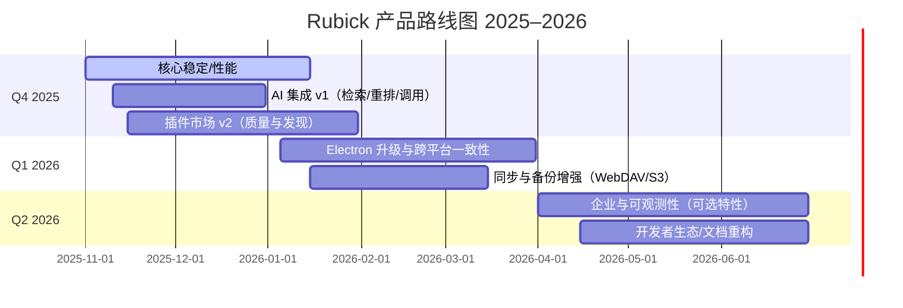

# Rubick 产品路线图（2025–2026）

> 本文档用于统一团队与社区对 Rubick 的中短期目标、优先级与时间节奏的认知，作为规划与评审的依据。路线将随反馈与数据动态调整，最新状态以本文为准。

- 面向对象：产品、工程、设计、增长、社区维护者与贡献者
- 周期覆盖：2025 Q4 – 2026 Q2（滚动更新）
- 关联文档：
  - 发布记录：[release/releaseNotes.md](release/releaseNotes.md)
  - AI 集成概览：[docs/development/ai-integration.md](docs/development/ai-integration.md)
  - 插件市场使用指南：[docs/guide/plugin-market.md](docs/guide/plugin-market.md)
  - 贡献流程：[docs/contributing/contribution-guide.md](docs/contributing/contribution-guide.md)
  - 发布流程：[docs/contributing/release-process.md](docs/contributing/release-process.md)

---

## 1. 愿景与产品原则

- 愿景：打造“即开即用、可被扩展、跨平台的效率枢纽”，以插件生态连接多场景工作流，并逐步融入 AI 助力。
- 原则：
  1) 以稳定/性能为先；
  2) 插件优先与向后兼容；
  3) 隐私与安全默认开启；
  4) 跨平台一致体验；
  5) 数据驱动优先级，公开透明的路线变更。

---

## 2. 路线图总览（Mermaid）



---

## 3. Now / Next / Later（滚动优先级）

- Now（当前进行中，立即收益）
  - 核心稳定/性能：启动速度、内存占用、索引速度、渲染卡顿优化
  - AI 集成 v1：命令检索增强、搜索重排、简单动作编排（参考：[docs/development/ai-integration.md](docs/development/ai-integration.md)）
  - 插件市场 v2：安全校验、评分排序、安装体验与崩溃隔离（参考：[docs/guide/plugin-market.md](docs/guide/plugin-market.md)）

- Next（下一阶段，季度交付）
  - Electron 升级与跨平台一致体验（Win/Linux/macOS UI 与行为对齐）
  - 同步与备份增强：WebDAV 可靠性、S3 适配、差量同步、冲突解决（参考：后端 WebDAV：[docs/backend/getting-started/environment-setup.md](docs/backend/getting-started/environment-setup.md) 与 [src/core/db/webdav.ts](src/core/db/webdav.ts)）

- Later（储备，等待验证/依赖解除）
  - 企业特性（可选）：离线镜像、策略控制、私有插件源、可观测性与审计
  - 开发者生态：SDK 增强、脚手架与模板、端到端示例、文档重构
  - 高级 AI 场景：多步代理、跨应用编排、可视化工作流

---

## 4. 季度里程碑与交付

### 2025 Q4（11–12 月）

1) 史诗：核心稳定/性能
- 目标：P95 启动 < 800ms，空闲内存占用下降 20%，应用索引耗时下降 30%
- 交付：
  - 冷启动关键路径压缩（懒加载、资源拆分与缓存）
  - 搜索索引器增量与缓存策略优化（参考：[src/core/app-search/index.ts](src/core/app-search/index.ts)）
  - 渲染卡顿点排查与修复（虚拟列表、批量更新）
- 验收：性能对比基线报告、自动回归基准脚本、稳定性崩溃率 < 0.1%

2) 史诗：AI 集成 v1
- 目标：将 AI 用于“更好地找到/触达命令”，而非替代所有交互
- 交付：
  - 命令/插件语义检索与结果重排
  - 简单动作串联（例如“复制-转换-粘贴”）
  - 本地/云模型配置与降级策略（参考：[docs/guide/ai-settings.md](docs/guide/ai-settings.md)）
- 验收：A/B 测试 Top-1 精度 +15%，用户成功率提升，失败回退逻辑完善

3) 史诗：插件市场 v2
- 目标：更安全、可发现、可度量
- 交付：
  - 插件清单校验与权限声明
  - 排序模型融入质量信号（下载量、评分、崩溃率、维护频率）
  - 安装/升级体验统一、沙箱/隔离与崩溃防护
- 验收：问题插件拦截率、安装成功率、升级回滚可用性

### 2026 Q1（1–3 月）

1) Electron 升级与跨平台一致体验
- 目标：统一行为与快捷键，减少平台分歧
- 交付：
  - Electron 版本升级与原生 API 差异修复
  - Darwin/Win/Linux 功能对齐（参考：[src/core/app-search/darwin.ts](src/core/app-search/darwin.ts)、[src/core/app-search/win.ts](src/core/app-search/win.ts)、[src/core/app-search/linux.ts](src/core/app-search/linux.ts)）
- 验收：回归用例通过率 100%，跨平台一致性问题清零

2) 同步与备份增强（WebDAV/S3）
- 目标：安全可靠、可观测的配置/插件/数据同步
- 交付：
  - WebDAV 稳定性与断点续传、S3 适配与端到端测试
  - 差量与冲突解决策略、错误可视化与重试
- 验收：数据一致性与恢复演练、失败场景 MTTR 指标

### 2026 Q2（4–6 月）

1) 企业与可观测性（可选特性）
- 交付：
  - 私有插件源、策略与权限、离线镜像
  - 可观测性：匿名度量、错误上报、隐私保护与开关
- 验收：合规评审通过、隐私开关默认开启、数据最小化

2) 开发者生态/文档重构
- 交付：
  - SDK 与模板、脚手架、端到端示例
  - 文档体系重构：从“概览-快速开始-API-范式-示例-故障排除”贯通（参考：[docs/development/plugin-development.md](docs/development/plugin-development.md)、[docs/development/api.md](docs/development/api.md)）
- 验收：第三方插件数量与质量提升、首次集成用时下降

---

## 5. 关键指标（KR）与验收标准

- 性能：P95 启动时延、内存占用、索引耗时、渲染帧率
- 稳定性：崩溃率、插件崩溃隔离成功率、失败自动恢复率
- 质量：安装/升级成功率、回滚成功率、跨平台一致性缺陷数
- 增长：月活（MAU）、留存（D1/D7/D30）、插件安装量与活跃度
- AI 体验：Top-1/Top-3 精度、任务完成率、回退触发率
- 文档与生态：首次集成用时、文档 NPS、示例覆盖率

---

## 6. 依赖与风险

- 依赖：Electron 版本稳定性、平台 API 权限策略、第三方模型与网络可用性
- 风险：
  - 高并发同步场景下的数据一致性与冲突
  - AI 回退策略与隐私合规（默认本地优先、显式开关）
  - 跨平台行为差异导致的回归
- 缓解：灰度发布、特性开关、金丝雀渠道、A/B 实验与回滚机制（参考：[docs/contributing/release-process.md](docs/contributing/release-process.md)）

---

## 7. 发布节奏与版本管理

- 建议节奏：
  - Patch：随时（修复/微优化）
  - Minor：月度（小特性/增强）
  - Quarterly：里程碑（组合大特性/升级）
- 记录：所有版本细节沉淀至 [release/releaseNotes.md](release/releaseNotes.md)

---

## 8. 路线变更流程（Light RFC）

- 变更触发：数据/用户反馈/安全合规/依赖变更
- 提案要求：问题背景、目标与非目标、方案设计、影响面、验收与回滚、里程碑与资源评估
- 提交路径：PR 到路线文档与相关设计文档，遵循 [docs/contributing/contribution-guide.md](docs/contributing/contribution-guide.md)
- 评审机制：周例会快审、月度路线复盘与季度 OKR 校准

---

## 9. 附录：相关参考

- AI： [docs/development/ai-integration.md](docs/development/ai-integration.md), [docs/development/ai-plugin-api.md](docs/development/ai-plugin-api.md), [docs/guide/ai-settings.md](docs/guide/ai-settings.md)
- 插件市场： [docs/guide/plugin-market.md](docs/guide/plugin-market.md), [docs/backend/services/plugin-market.md](docs/backend/services/plugin-market.md)
- 开发与部署： [docs/development/overview.md](docs/development/overview.md), [docs/development/deployment.md](docs/development/deployment.md)
- 后端与环境： [docs/backend/getting-started/quick-start.md](docs/backend/getting-started/quick-start.md), [docs/backend/getting-started/environment-setup.md](docs/backend/getting-started/environment-setup.md)

---

## 10. 创新功能候选与优先级建议

为提升可用性与生态活力，以下功能作为候选项纳入路线图考量，均提供价值、实现线索与度量（KR），便于择优进入 Now/Next/Later。

### 10.1 功能图谱（Mermaid）
```mermaid
flowchart LR
  A[AI 体验增强] --> A1[语义检索 & 结果重排]
  A --> A2[Promptless 智能建议]
  A --> A3[多步行动编排]

  B[工作流与自动化] --> B1[可视化工作流编辑器]
  B --> B2[宏录制/回放]
  B --> B3[情境触发器(剪贴板/窗口/文件类型)]

  C[插件生态] --> C1[权限声明 & 沙箱]
  C --> C2[签名/审核/评分模型]
  C --> C3[插件依赖/兼容图谱]

  D[同步/配置] --> D1[工作区配置档(Profiles)]
  D --> D2[离线插件包/缓存]
  D --> D3[审计 & 冲突可视化]

  E[可观测 & 安全] --> E1[隐私优先遥测(可开关)]
  E --> E2[崩溃隔离与安全模式]
  E --> E3[企业策略/私有源]
```

### 10.2 Promptless 智能建议（打字即提示、不打扰）
- 价值：减少输入与思考成本，提升命令命中率与任务完成率。
- 实现线索：
  - 将语义补全/重排嵌入搜索 UI（非模态、随时关闭），本地向量与轻量模型优先，云为增益。
  - 接入点：[src/renderer/plugins-manager/search.ts](src/renderer/plugins-manager/search.ts)、[docs/guide/ai-settings.md](docs/guide/ai-settings.md)
- KR：Top-1 命中率 +15%，建议点击转化率 > 20%，取消/打断率 < 5%。

### 10.3 多步行动编排（Action Graph）
- 价值：把“复制→转换→粘贴”等跨应用任务流水线化，显著减少重复操作。
- 实现线索：
  - 可视化节点/边编辑器；节点为插件或系统动作；运行时支持断点、回退与重试。
  - 接入点：[src/core/plugin-handler/index.ts](src/core/plugin-handler/index.ts)、[docs/development/ai-plugin-api.md](docs/development/ai-plugin-api.md)、[src/main/common/registerHotKey.ts](src/main/common/registerHotKey.ts)
- KR：复用工作流占比 > 30%，失败场景 MTTR 下降 40%。

### 10.4 宏录制/回放（无代码自动化）
- 价值：把真实操作录为可重放脚本/工作流，极低门槛获得自动化收益。
- 实现线索：
  - 录制热键、选择、剪贴板等事件序列，导出为可编辑工作流，与 Action Graph 打通。
  - 接入点：[src/renderer/plugins-manager/clipboardWatch.ts](src/renderer/plugins-manager/clipboardWatch.ts)、[src/renderer/plugins-manager/pluginClickEvent.ts](src/renderer/plugins-manager/pluginClickEvent.ts)
- KR：录制转化率 > 50%，宏执行成功率 > 95%。

### 10.5 情境触发器（Context Triggers）
- 价值：基于剪贴板/活动窗口/文件类型自动建议相关动作或工作流。
- 实现线索：
  - 触发源：剪贴板、窗口标题/类名、文件扩展名、系统事件；白/黑名单与显式开关。
  - 接入点：[src/renderer/plugins-manager/clipboardWatch.ts](src/renderer/plugins-manager/clipboardWatch.ts)、[src/core/app-search/index.ts](src/core/app-search/index.ts)
- KR：触发建议点击率 > 25%，误触发率 < 2%。

### 10.6 插件权限声明、沙箱与签名体系
- 价值：提升安全与可控性，降低恶意或不稳定插件风险。
- 实现线索：
  - manifest 权限最小授权；运行时隔离/资源配额；签名与社区审核/评分合入排序。
  - 接入点：[src/core/plugin-handler/index.ts](src/core/plugin-handler/index.ts)、[docs/backend/services/plugin-market.md](docs/backend/services/plugin-market.md)
- KR：问题插件拦截率 > 95%，崩溃隔离成功率 > 98%。

### 10.7 插件依赖/兼容图谱（Extension Graph）
- 价值：透明的依赖与兼容关系，提升组合效率，减少踩坑。
- 实现线索：
  - 可视化依赖与兼容矩阵；与市场排序信号联动（维护频率、崩溃率、评分）。
  - 参考：[docs/guide/plugin-market.md](docs/guide/plugin-market.md)、[docs/backend/services/plugin-market.md](docs/backend/services/plugin-market.md)
- KR：组合安装转化率 +20%，兼容性问题 -50%。

### 10.8 工作区配置档（Profiles）
- 价值：一键在“开发/写作/会议”等场景间切换插件集和设置。
- 实现线索：
  - 配置分层（全局/工作区/场景），支持导入/导出与分享。
  - 接入点：[src/common/utils/localConfig.ts](src/common/utils/localConfig.ts)
- KR：配置切换成功率 > 99%，场景切换使用占比 > 40%。

### 10.9 离线插件包与缓存策略
- 价值：低网或离线环境可用；企业环境可控分发。
- 实现线索：
  - 压缩镜像、离线校验、增量更新与缓存预热。
  - 接入点：[src/core/db/webdav.ts](src/core/db/webdav.ts)、[docs/backend/deployment/docker.md](docs/backend/deployment/docker.md)
- KR：离线安装成功率 > 95%，首次安装耗时 -30%。

### 10.10 冲突解决与审计（同步增强）
- 价值：数据一致性、可恢复性与信任度提升。
- 实现线索：
  - 差量合并、冲突可视化、操作审计日志与回滚。
  - 接入点：[src/core/db/webdav.ts](src/core/db/webdav.ts)
- KR：冲突解决成功率 > 90%，数据丢失事件 0。

### 10.11 可观测性与隐私优先遥测（可选，默认关闭）
- 价值：数据驱动迭代，同时保障隐私控制权。
- 实现线索：
  - 事件最小化与匿名化、显式开关与导出、崩溃隔离与安全模式入口。
  - 参考：[docs/contributing/release-process.md](docs/contributing/release-process.md)
- KR：隐私投诉 0，崩溃回收成功率 > 98%，文档 NPS > 50。

### 10.12 开发者生态加速包
- 价值：降低上手门槛，促进生态繁荣。
- 实现线索：
  - CLI 脚手架、模板与端到端示例；文档体系重构（概览→快速开始→API→范式→示例→故障排除）。
  - 参考：[docs/development/plugin-development.md](docs/development/plugin-development.md)、[docs/development/api.md](docs/development/api.md)
- KR：首次集成用时 -40%，月新增优质插件 +30%。

### 10.13 纳入 Now/Next/Later 的建议
- Now：10.2 Promptless 智能建议、10.3 多步行动编排、10.5 情境触发器、10.6 权限/沙箱/签名
- Next：10.8 Profiles、10.9 离线插件包与缓存、10.10 冲突与审计、10.12 开发者生态加速包
- Later：10.7 依赖/兼容图谱、10.11 可观测性（默认关闭）、跨设备协作（探索）

提示：落地时按“问题背景—方案—依赖—风险—验收—KR—里程碑”的轻量 RFC 增补至第 8 节所述流程。

---

## 11. AI 支持改进路线（架构、体验与评估）

本节聚焦 AI 能力的系统化改进，覆盖架构、用户体验、评估与隐私合规，按季度落地并与路线文档的里程碑联动。

### 11.1 目标与原则
- 目标：让 AI 成为“更快找到并完成任务”的助推器，而非强制入口；在稳定、可控、低打扰的前提下提升效率。
- 原则：
  1) 本地优先、云为增益（可离线运行、清晰的成本与隐私边界）。
  2) 可回退、可解释、可观测（失败可恢复，决策可追踪）。
  3) 小步快跑、数据驱动（A/B 与度量闭环）。

### 11.2 架构总览（Mermaid）
```mermaid
flowchart TB
  U[用户] --> UI[Rubick UI]
  UI --> ID[意图检测 / 轻量分类]
  ID --> RET[检索层 RAG \n命令/插件向量检索]
  RET --> PLAN[规划器 \n多步行动/工具选择]
  PLAN --> EXEC[执行器 \n插件/系统动作调用]
  EXEC --> OBS[可观测与度量 \n日志/事件/指标]
  OBS --> MEM[记忆与缓存 \n嵌入/会话/提示缓存]
  EXEC --> UI

  subgraph 本地优先
    EMB[本地向量索引/嵌入存储]
    LLM[本地小模型(可选)]
    CACHE[提示/结果缓存]
  end

  subgraph 云增益(可选)
    CLM[云端模型/路由]
    COST[成本与速率限制]
  end

  ID --> EMB
  RET --> EMB
  PLAN --> LLM
  PLAN --> CLM
  MEM --> CACHE
```

### 11.3 2025 Q4：AI 基础（RAG + 重排 + 低打扰建议）
- 交付：
  - 命令/插件向量索引与 RAG 检索；搜索结果重排与相关度提升。
  - Promptless 智能建议（非模态、可关闭），与搜索 UI 融合。
  - 本地优先的嵌入与缓存策略；明确的云回退与成本开关（参考：[`docs/guide/ai-settings.md`](docs/guide/ai-settings.md)）。
  - 接入点：[`src/renderer/plugins-manager/search.ts`](src/renderer/plugins-manager/search.ts)、[`src/core/app-search/index.ts`](src/core/app-search/index.ts)。
- 验收/KR：Top-1 命中率 +15%，建议点击转化率 > 20%，取消/打断率 < 5%。

### 11.4 2026 Q1：规划器与工具调用（Action Graph + 回退与隐私）
- 交付：
  - 规划器(Planner) 将多步任务编排为可执行图（Action Graph）；失败回退与重试策略。
  - 宏录制/回放与工作流打通（低代码自动化）。
  - 隐私与成本：本地/云模型路由、速率限制、用户预算与显式开关。
  - 接入点：[`src/core/plugin-handler/index.ts`](src/core/plugin-handler/index.ts)、[`docs/development/ai-plugin-api.md`](docs/development/ai-plugin-api.md)、[`src/main/common/registerHotKey.ts`](src/main/common/registerHotKey.ts)。
- 验收/KR：复用工作流占比 > 30%，失败场景 MTTR -40%，云调用成本可视化与可控。

### 11.5 2026 Q2：多模态与开发者 API（优化与生态）
- 交付：
  - 多模态：剪贴板图片/OCR、窗口快照文本化，情境触发器精度提升。
  - 开发者 AI API：标准化插件能力声明（Tool/Action/权限），清晰上下文注入与提示模板管理。
  - 文档与示例：端到端示例与最佳实践沉淀（参考：[`docs/development/plugin-development.md`](docs/development/plugin-development.md)、[`docs/development/api.md`](docs/development/api.md)）。
- 验收/KR：情境触发建议点击率 > 25%，误触发率 < 2%，第三方 AI 能力接入成功率 > 95%。

### 11.6 体验细节与产品化改进
- 搜索融合：不改变用户路径，AI 用于重排与补全；保持键盘优先与低打扰。
- 解释与控制：对“为什么推荐”提供轻量解释；随时关闭/降级到纯本地模式。
- 快速回退：任何失败都可一键回退到传统执行路径（提升信任与可用性）。
- 成本/隐私面板：显示当月云调用预算、已用额度与隐私选项（默认本地优先）。

### 11.7 评估与度量（可观测）
- 离线基准：构建任务集（检索/重排/执行），对比不同模型与配置的精度与时延。
- 在线 A/B：对核心指标（Top-1/Top-3、任务完成率、回退触发率）进行分层实验。
- 观测面：错误分类、提示与工具调用日志最小化采集（匿名化、可导出），参考 [`docs/contributing/release-process.md`](docs/contributing/release-process.md)。

### 11.8 风险与缓解
- 隐私与合规：默认关闭云、显式开关与数据最小化；敏感上下文本地红线过滤。
- 稳定性：Planner 错误防护与断路器；失败自动回退到非 AI 流程。
- 成本控制：速率与预算限制、命中缓存与去重；清晰提示可能的云调用。

---

最后更新：2025-11-01（UTC+8）
